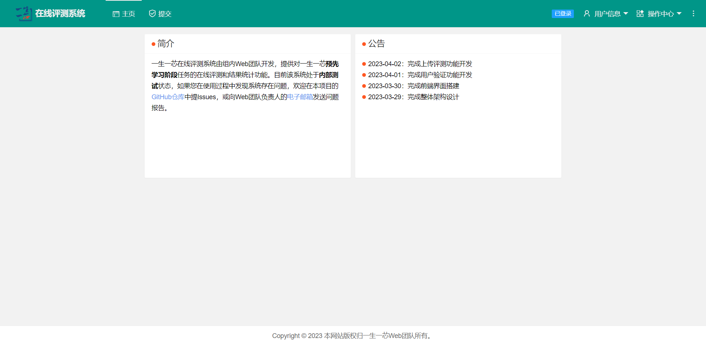

<p align="center">
    
</p>

<h1>
    <p align="center">一生一芯计划在线评测系统</p>
</h1>



<p align="center">
    <a title="Project Version">
        
    </a>
    <a title="Node Version" target="_blank" href="https://nodejs.org">
        
    </a>
    <a title="License" target="_blank" href="https://github.com/oscc-web/ysyx-oj-system/blob/master/LICENSE">
        
    </a>
    <br/>
    <a title="GitHub Watchers" target="_blank" href="https://github.com/oscc-web/ysyx-oj-system/watchers">
        
    </a>
    <a title="GitHub Stars" target="_blank" href="https://github.com/oscc-web/ysyx-oj-system/stargazers">
        
    </a>
    <a title="GitHub Forks" target="_blank" href="https://github.com/oscc-web/ysyx-oj-system/network/members">
        
    </a>
</p>

<p align="center">中文简体 | <a title="English" href="README.md">English</a></p>

<p align="center">
    <span>预览：</span>
    <a target="_blank" href="http://39.101.140.145:10140">一生一芯在线评测系统网站</a>
</p>

## 特性

- 系统框架全部自己实现
- 支持本地上传源码文件
- 支持在线查看评测结果
- 支持切换多种主题样式
- 支持自定义判题服务器

## 依赖

- `dayjs`版本 >= 1.11.7
- `formidable`版本 >= 1.2.1
- `uuid`版本 >= 9.0.0

## 使用

### 下载仓库

```sh
$> cd your-workspaces
$> git clone git@github.com:oscc-web/ysyx-oj-system.git
```

### 安装依赖

```sh
$> npm install
```

### 配置系统

根据本地开发机或远程服务器的端口占用情况，酌情修改`config/config.js`文件中`port`属性，确保与已启动服务端口不冲突即可。

### 运行系统

```sh
$> npm run init      # 初始化系统
$> npm run serve-dev # 运行服务器
```

### 更新仓库

```sh
$> cd your-workspaces/ysyx-oj-system
$> git pull
```

## 反馈

- 在本项目的GitHub Issues上提交错误或优化建议。
- 可以给我的电子[邮箱](mailto:oscc-web@126.com)发送你对本项目未来发展的想法或建议。

## 贡献

目前本项目的开发者只有我自己，我非常欢迎全世界的开源爱好者能够参与到本项目后续的开发过程中，如果你对本项目感兴趣并且愿意分享你的创意想法，请向我提交GitHub Issues或发送电子邮件，非常感谢！

## 感谢

- [Layui](https://layui.github.io)
- [EasyWeb](https://eleadmin.com)
- [dayjs](https://www.npmjs.com/package/dayjs)
- [formidable](https://www.npmjs.com/package/formidable)
- [uuid](https://www.npmjs.com/package/uuid)
